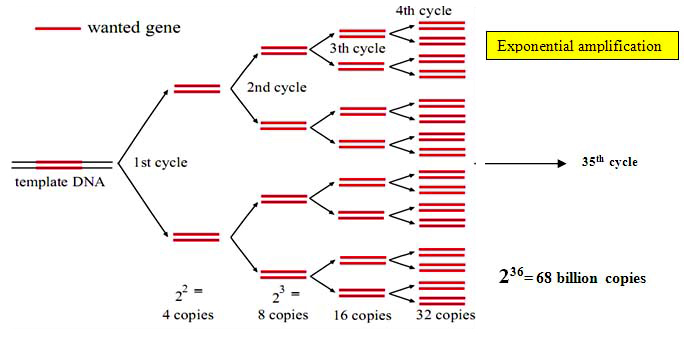

### Theory
 

Polymerase chain reaction, better known as PCR, is one of the technologies that not only made a tremendous impact on the scientific community, but also affected many aspects of our everyday lives. More than 30 years ago, the introduction of recombinant DNA technology as a tool for the biological sciences revolutionized the study of life. Molecular cloning allowed the study of individual genes of living organisms; however this technique was dependent on obtaining a relatively large quantity of pure DNA. This depended on the replication of the DNA of plasmids or other vectors during cell division of microorganisms. Researchers found it extremely laborious and difficult to obtain a specific DNA in quantity from the mass of genes present in a biological sample. A technique that amplifies DNA through a simple enzymatic reaction, was developed by Karry Mullis at that time which enabled scientists to make millions - or even billions - of copies of a DNA molecule in a very short time.

PCR has transformed the way that almost all studies requiring the manipulation of DNA fragments may be performed as a results of its simplicity and usefulness. In 1993, Mullis got Nobel Prize in Chemistry  for his dedicated work on PCR. It has been used to detect DNA sequences, to diagnose genetic diseases, to carry out DNA fingerprinting, to detect bacteria or viruses (particularly the AIDS virus), and to research human evolution. Previous techniques for isolating a specific piece of DNA relied on gene cloning - a tedious and slow procedure. PCR, on the other hand we pick the piece of DNA we're interested in and have as much of it as we want. Within a few years PCR - took the world's biological laboratories by storm. The polymerase chain reaction reaped the highest scientific honour for its inventor in record time as it provided a solution to one of the most pressing problems facing biology at the time - the replication of DNA.

 

PCR is a rapid, inexpensive and simple way of copying specific DNA fragments from minute quantities of source DNA material, even when that source DNA is of relatively poor quality. It does not necessarily require the use of radioisotopes or toxic chemicals. There are two reasons why you may want to amplify DNA.

 

You may want to simply create multiple copies of a portion of DNA which is very  rare. For example a forensic scientist may needs to amplify a small fragment of DNA from a crime scene.
You may wish to compare two different samples of DNA to know which is the more abundant. Because DNA is microscopic so you cannot see which sample contains the most DNA. However, if you amplify both samples at the same rate, you can calculate which sample was the biggest to begin with by establishing which is the biggest after amplification.
 

It is the Polymerase enzyme that drives a PCR. A polymerase will synthesize a complementary sequence of bases to any single strand of DNA providing it has a double stranded starting point. This is very useful because you can choose which gene you wish the polymerase to amplify in a mixed DNA sample by adding small pieces of DNA complimentary to your gene of interest. These small pieces of DNA are known as primers because they prime the DNA sample ready for the polymerase to bind and begin copying the gene of interest. During a PCR, changes in temperature are used to control the activity of the polymerase and the binding of primers.

 

To begin the reaction the temperature is raised to 95oC. At this temperature all double stranded DNA is "melted" in to single strands:

 

The temperature is then lowered to ~50oC. This allows the primers to bind to your gene of interest. Thus the polymerase has somewhere to bind and can begin copying the DNA strand:

 

The optimal temperature for the polymerase to operate is 72oC so at this point the temperature is sometimes raised to 72oC to allow the enzyme to work faster. There are now twice as many copies of your gene of interest as when you started:

 

The cycle of changing temperatures (95oC, 50oC and 72oC) is then repeated and two copies become four. Another cycle and four become eight, up to 30-35 cycles. After amplifying your gene into many millions of copies it is possible to run the amplified DNA out on an agarose gel and stain it with a dye to visualize it. The bigger the visible band, contains more copies of  gene of  interest that  you have created.

 

### Working principle of PCR
 

As the name implies, it is a chain reaction, a small fragment of the DNA section of interest needs to be identified which serves as the template for producing the primers that initiate the reaction. One DNA molecule is used to produce two copies, then four, then eight and so forth. This continuous doubling is accomplished by specific proteins known as polymerases, enzymes that are able to string together individual DNA building blocks to form long molecular strands. To do their job polymerases require a supply of DNA building blocks, i.e.,  the nucleotides consisting of the four bases adenine (A), thymine (T), cytosine (C) and guanine (G). They also need a small fragment of DNA, known as the primer, to which they attach the building blocks as well as a longer DNA molecule to serve as a template for constructing the new strand. If these three ingredients are supplied, the enzymes will construct exact copies of the templates.

Number of copies of DNA obtained after 'n' cycles = 2(n+1)

 

It is then possible to clone DNA whose sequence is unknown. This is one of the method's major advantages. Genes are commonly flanked by similar stretches of nucleic acid. Once identified, these patterns can be used to clone unknown genes - a method that has supplanted the technique of molecular cloning in which DNA fragments are tediously copied in bacteria or other host organisms. With the PCR method this goal can be achieved faster, more easily and above all in vitro, i.e.,  in the test-tube. Moreover, known sections of long DNA molecules, e.g. of chromosomes, can be used in PCR to scout further into unknown areas.

 

### Parameters that affect PCR
 

#### Essential components of polymerase chain reactions:

 

1. A thermostable DNA polymerase to catalyse template-dependent synthesis of DNA:
 

Depending on the ability,  fidelity,  efficiency to synthesize large DNA products,  a wide choice of enzymes is now available. For routine PCRs, Taq polymerase(0.5-2.5 units per standard 25-50 uL reaction)remains the enzyme of choice. The specific activity of most commercial preparations of Taq is ~80,000 units/mg of protein. Since the efficiency of primer extension with Taq polymerase is generally ~0.7, the enzyme becomes limiting when 1.4*1012 to 7*1012 molecules of amplified product have accumulated in the reaction.

 

2. A pair of synthetic oligonucleotides to prime DNA synthesis:
 

Design of the oligonucleotide primer being the most important factor that influence the efficiency and specificity of the amplification reaction, careful designing of primers is required to obtain the desired products in high yield, to suppress amplification of unwanted sequences and to facilitate subsequent manipulation of the amplified product. Since the primers so heavily influence the success or failure of PCR protocols, it is ironic that the guidelines for their design are largely qualitative and are based more on common sense than on well understood thermodynamic or structural principles.

 

3. Design of oligonucleotide primers for PCR

 

In certain situations, it may be desirable to amplify several segments of target DNA simultaneously. In these cases,  an amplification reaction named "multiplex PCR" is used that includes more than one pair of primer in the reaction mix. Standard reactions contain non-limiting amount of primers, typically 0.1-0.5μM of each primer(6*1012 to 3*1013 molecules). This quantity is enough for atleast 30 cycles of amplification of a 1 kb segment of DNA. Higher concentrations of primers favour mispriming which may lead to nonspecific amplification.

 

4. Deoxynucleoside triphosphates(dNTPs)
 

Standard PCR reactions contain equimolar amounts of all four dNTPs. Concentrations of 200–250 µM of each dNTP are recommended for Taq polymerase in reactions containing 1.5 mM MgCl₂. In a 50 µL reaction, these amounts should allow synthesis of approximately 6–6.5 µg of DNA, which should be sufficient even for multiplex reactions where eight or more primer pairs are used simultaneously. High concentrations of dNTPs (>4 mM) are inhibitory, possibly due to the sequestration of Mg²⁺. However, a satisfactory amount of amplified product can still be produced with dNTP concentrations as low as 20 µM — yielding about 0.5–1.0 pM of an amplified fragment approximately 1 kb in length.

To avoid problems, dNTP stocks should be stored at –20 °C in small aliquots, which should be discarded after the second freeze–thaw cycle. During long-term storage at –20 °C, small amounts of water may evaporate and then freeze on the walls of the vial. To minimize concentration changes, vials containing dNTP solutions should be centrifuged for a few seconds in a microcentrifuge after thawing.
 

5. Divalent cations
 

All thermostable DNA polymerases require free divalent cations- usually Mg2+ for activity. Some polymerases will also work, albeit less efficiently with buffers containing Mn2+. Calcium ions are quite ineffective. Because dNTPs and oligonucleotides bind Mg2+, the molar concentration of the cation must exceed the molar concentration of phosphate groups contributed by dNTPs and primers. It is therefore impossible to recommend a concentration of Mg2+ that is optional in all circumstances. Although a concentration of 1.5 mM of Mg2+ is routinely used, increasing the concentration of Mg2+ to 4.5 mM or 6mM has been reported to decrease nonspecific priming in some cases and to increase it in others. The optimal concentration of Mg2+ must therefore must be determined empirically for each combination of primers and template. The preparations of template DNA should not contain significant amount of chelating agents (like EDTA or negatively charged ions like PO43-), which can sequester Mg2+.

 

6. Buffer to maintain pH
 

Tris -Cl ,adjusted to a pH between 8.3 and 8.8 at room temperature is included in standard PCRs at a concentration of 10mM. When incubated at 72oC(extension phase of PCR), the pH of the reaction mixture drops by more than a full unit, producing a buffer whose pH is ~7.2.

 

7. Monovalent cations
 

Standard PCR buffer contains 50mM KCl and works well for amplification of segments of DNA >500bp in length. Raising the KCl concentration to ~70-100mM often improves the yield of shorter DNA segments.

 

#### Template DNA:
 

Template DNA containing target sequences can be added to PCR in single or double stranded form. Closed circular DNA templates are amplified slightly less efficiently than linear DNAs. All though the size of the template DNA is not critical, amplification of sequences embedded in high molecular weight DNA(>10kb) can be improved by digesting the template with a restriction enzyme that doesn't cleave within the target sequence.

  

When working at its best, PCR requires only a single copy of the target sequence as a template. More typically, however, several thousand copies of the target DNA are seeded into the reaction. In the case of mammalian genomic DNA, up to 1 µg of DNA is utilized per reaction, an amount that contains approximately 3 × 10⁵ copies of a single-copy autosomal gene. The typical amounts of yeast, bacterial, and plasmid DNAs used per reaction are 10 µg, 1 µg, and 1 pg, respectively.

   

#### Programming PCRs
 

PCR is an iterative process, consisting of 3 elements; denaturation of the template by heat, annealing of the oligonucleotide primers to the single stranded target sequence(s), and extension of the annealed primers by a thermostable DNA polymerase.

 

#### Denaturation
 

Double stranded DNA templates denature at a temperature that is determined in part by their G+C content. The higher the proportion of G+C, the higher the temperature required to separate the strands of template DNA. The longer the DNA molecules, the greater the time required at the chosen denaturation temperature to separate the two strands completely. If the temperature for denaturation is too low or if the time is too short at AT rich regions of the template DNA will be denatured. When the temperature is reduced later in the PCR cycle, the template DNA will reanneal into fully native condition. In PCRs catalyzed by Taq polymerase, denaturation is carried out at 94-95oC, which is the highest temperature that the enzyme can endure for 30 or more cycles without sustaining excessive damage. In the first cycle of PCR, denaturation is sometimes carried out for 5 minutes to increase the probability that long molecules of template DNA are fully denatured. However this extended period of denaturation temperature is unnecessary for linear DNA molecules as it may be deleterious sometimes. Denaturation for 45 seconds at 94-95oC is routinely used to amplify linear DNA molecules whose GC content is <55% and higher temperature for template and/or target DNAs whose GC content is >55%. So much more heat tolerant polymerases are preferred in such cases.

 

#### Annealing of primers to template DNA
 

The temperature used for the annealing step is critical.  If the annealing temperature is too high, the oligonucleotide primers anneal poorly, if at all to the template and the yield of amplified DNA is very low. If the annealing temperature is too low, non specific annealing of primers may occur, resulting in the amplification of unwanted segments of DNA. Annealing is usually carried out 3-5o C lower than the calculated melting temperature at which the oligonucleotide primers dissociate from their templates. Many formulas exist to determine the theoretical Tm,  but none of them are accurate for oligonucleotide primers for all lengths and sequences. It is best to optimize the annealing conditions by performing a series of trial PCRs at temperatures ranging from 2C to 10 C below the lower of melting temperatures calculated for the two oligonucleotide primers. Alternatively, the thermal cycler can be programmed to use progressively lower annealing temperatures in consecutive pairs of cycles ("touchdown" PCR. Instead of surveying a variety of annealing conditions in separate PCRs, optimization is achieved by exposing a single PCR to a sequential series of annealing temperatures in successive cycles of the reaction.

 

<b>Extension of oligonucleotide primers</b> is carried out at or near the optimal temperature for DNA synthesis catalyzed by the thermostable polymerase, which in the case of Taq polymerase is 72-78oC. In the first two cycles, extension from one primer proceeds beyond the sequence complementary to the binding site of the other primer. In the next cycle, the first molecules are produced whose length is equal to the segment of DNA delimited by the binding sites of the primers. From the third cycle onwards, this segment of DNA is amplified geometrically, whereas longer amplification products accumulate arithmetically. The polymerization rate of Taq polymerase is ~2000 nucleotides /minute at the optimal temperature (72-78oC) and as a rule of thumb, extension is carried out for 1 minute for every 1000bp of product. For the last cycle of PCR, many investigators use an extension time that is 3 times longer than the previous cycles, ostensibly to allow completion of all amplified products.

 

#### Number of cycles
 

The number of cycles required for amplification depends on the number of copies of template DNA present at the beginning of the reaction and the efficiency of primer extension and amplification. Once established in the geometric phase, the reaction proceeds until one of the components becomes limiting. At this point, the yield of specific amplification products should be maximal, whereas nonspecific amplification products should be barely detectable, if at all. This is generally the case after \~30 cycles in PCRs containing \~10^5 copies of the target sequence and Taq DNA polymerase (efficiency \~0.7). Atleast 25 cycles are required to achieve acceptable levels of amplification of single copy target sequences in mammalian DNA templates.

